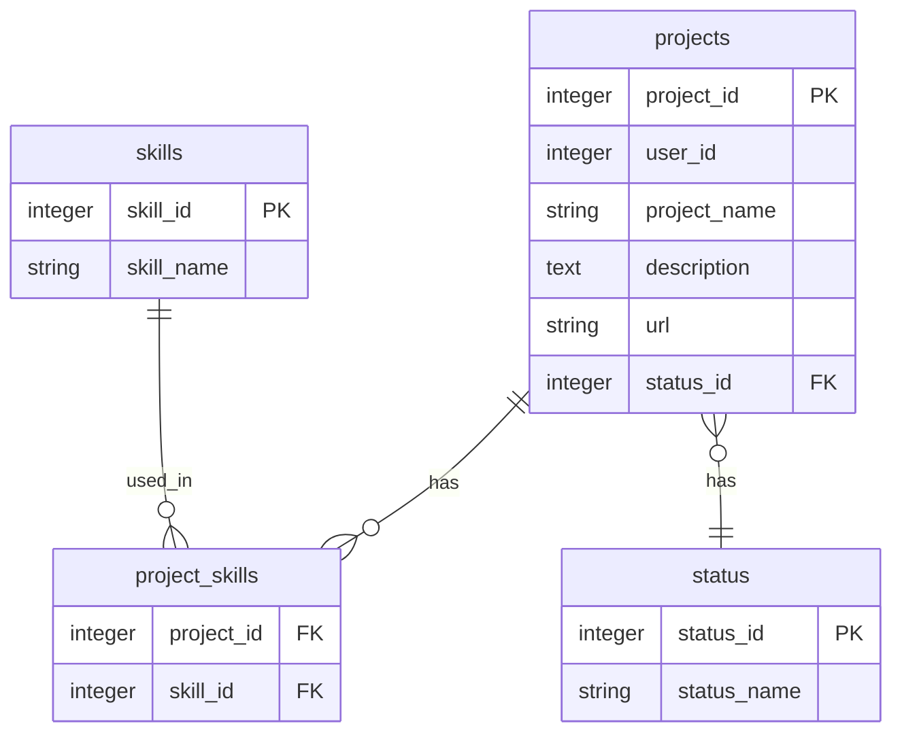

# 🚀 Project Portfolio Telegram Bot

<div align="center">


**Telegram бот для управления портфолио проектов с базой данных SQLite**

[Установка](#-установка) • [Использование](#-использование) • [Функции](#-функции) • [База данных](#-база-данных) • [Разработка](#-разработка)

</div>

## 📖 О проекте

Telegram бот позволяет пользователям удобно управлять своим IT-портфолио: добавлять проекты, отслеживать статусы разработки, привязывать технологии и просматривать всю информацию в структурированном виде.

## ✨ Возможности

### 🎯 Основные функции
- ✅ **Полное управление проектами** - добавление, редактирование, удаление
- 🔧 **Система технологий** - привязка навыков к проектам
- 📊 **Трекер статусов** - 5 этапов разработки проекта
- 👤 **Изоляция данных** - каждый пользователь видит только свои проекты
- 💾 **Локальное хранение** - данные в SQLite без внешних зависимостей

### 🛠 Технологии проекта
- **Python 3.8+** - основной язык разработки
- **SQLite3** - реляционная база данных
- **python-telegram-bot** - для работы с Telegram API

## 🏗️ Архитектура

### Структура базы данных

### 📁 Структура проекта
```
portfolio-telegram-bot/
│
├── 📁 src/
│   ├── logic.py              # Основная логика работы с БД
│   ├── bot.py                # Основной файл Telegram бота
│   └── config.py             # Конфигурационные параметры
│
├── 📁 database/
│   └── portfolio.db          # Файл базы данных
│
├── requirements.txt          # Зависимости проекта
├── README.md                 # Документация
└── .gitignore               # Исключения для Git
```

## 📄 Лицензия
Этот проект распространяется под лицензией MIT. Смотрите файл [LICENSE](https://github.com/AlexGame2012/bot_portfolio/blob/main/LICENSE) для подробностей.

## 📞 Поддержка
Если у вас возникли вопросы или проблемы:

Создайте Issue в репозитории

Напишите на email: info@alexstudiocode.ru
                   support@alexstudiocode.ru

<div align="center">
⭐ Не забудьте поставить звезду, если проект вам понравился!
</div>
